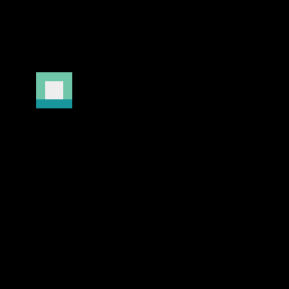

# Pyxel API sample

更新日：2023-03-25  
バージョン：Pyxel 1.9版  
  
## contents
・[システム](api_system.md#システム), [リソース](api_system.md#リソース), [入力](api_system.md#入力)  
・[グラフィックス](api_graphics.md#グラフィックス), [イメージクラス](api_graphics.md#イメージクラス), [タイルマップクラス](api_graphics.md#タイルマップクラス)   
・[オーディオ](api_audio.md#オーディオ), [サウンドクラス](api_audio.md#サウンドクラス), [ミュージッククラス](api_audio.md#サウンドクラス)   
・[数学](api_math.md)    
  
[Pyxel APIリファレンス](https://github.com/kitao/pyxel/blob/main//docs/README.ja.md) のAPI実行例です。 
（公式サンプルは[03_draw_api.py](https://github.com/kitao/pyxel/blob/main/python/pyxel/examples/03_draw_api.py)を参照してください）  

※下記import文でPyxelをインポートしたときのAPIの呼び出し記述になります。
``` python
import pyxel
```
  
## グラフィックス
- colors  
  パレットの表示色リスト。表示色は 24 ビット数値で指定します。
``` python
pyxel.colors[3] = 0x19C5FA    # 表示色3を薄い青色に変更
pyxel.cls(3)
```
・Python リストを直接代入、取得する場合はcolors.from_listとcolors.to_listを使用してください。
``` python
# デフォルトのカラーパレットを退避
org_colors = pyxel.colors.to_list()

# デフォルトのカラーパレットで復帰
pyxel.colors.from_list(org_colors)
```
  
- image(img)  
  イメージバンクimg (0-2) を操作します。([イメージクラス](#イメージクラス)を参照のこと)
  
- tilemap(tm)  
  タイルマップtm (0-7) を操作します。([タイルマップクラス](#タイルマップクラス)を参照のこと)
  
- clip(x, y, w, h)  
  画面の描画領域を (x, y) から幅w、高さhに設定します。clip()で描画領域を全画面にリセットします。
``` python
import pyxel
pyxel.init(64, 64)
pyxel.mouse(True)

def update():
    return

def draw():
    pyxel.cls(1)
    pyxel.rectb(2,2,60,60,10)
    pyxel.text(8,28,"Hello world!",7)
    pyxel.clip(pyxel.mouse_x,pyxel.mouse_y, 32,32)
    return

pyxel.run(update, draw)
```
  
- camera(x, y)  
  画面の左上隅の座標を (x, y) に変更します。camera()で左上隅の座標を (0, 0) にリセットします。
``` python
import pyxel
pyxel.init(64, 64)

def update():
    return

def draw():
    pyxel.cls(1)
    pyxel.camera(-5,-5)
    pyxel.rectb(2,2,60,60,10)
    pyxel.text(8,28,"Hello world!",7)
    return

pyxel.run(update, draw)
```
  
- pal(col1, col2)  
  描画時に色col1をcol2に置き換えます。pal()で初期状態にリセットします。
``` python
import pyxel
pyxel.init(64, 64)

toggle = 0
def update():
    global toggle
    if pyxel.btnp(pyxel.MOUSE_BUTTON_LEFT):
        toggle = 1 - toggle
    return

def draw():
    pyxel.cls(1)
    pyxel.rectb(2,2,60,60,10)
    pyxel.text(8,28,"Hello world!",7)
    if toggle:
        pyxel.pal(1,7)
        pyxel.pal(7,1)
    else:
        pyxel.pal()
    return

pyxel.run(update, draw)
```
  
- cls(col)  
  画面を色colでクリアします。
``` python
pyxel.cls(0)
```
  
- pget(x, y)  
  (x, y) のピクセルの色を取得します。
``` python
import pyxel
pyxel.init(64, 64)

col = 0
def update():
    global col
    col = pyxel.pget(pyxel.mouse_x, pyxel.mouse_y)
    return

def draw():
    pyxel.cls(1)
    for i in range(16):
        pyxel.rect(4*i,0,4,40,i)
    pyxel.text(8,48,"col="+str(col),7)
    return

pyxel.run(update, draw)
```
  
- pset(x, y, col)  
  (x, y) に色colのピクセルを描画します。
``` python
import pyxel
pyxel.init(64, 64)

def update():
    return

def draw():
    #pyxel.cls(0)
    pyxel.pset(pyxel.mouse_x, pyxel.mouse_y,pyxel.rndi(1,15))
    return

pyxel.run(update, draw)
```
  
- line(x1, y1, x2, y2, col)  
  色colの直線を (x1, y1)-(x2, y2) に描画します。

- rect(x, y, w, h, col)  
  幅w、高さh、色colの矩形を (x, y) に描画します。※矩形（くけい）は長方形

- rectb(x, y, w, h, col)  
  幅w、高さh、色colの矩形の輪郭線を (x, y) に描画します。

- circ(x, y, r, col)  
  半径r、色colの円を (x, y) に描画します。

- circb(x, y, r, col)  
  半径r、色colの円の輪郭線を (x, y) に描画します。

- elli(x, y, w, h, col)  
  幅w、高さh、色colの楕円を (x, y) に描画します。

- ellib(x, y, w, h, col)  
  幅w、高さh、色colの楕円の輪郭線を (x, y) に描画します。

- tri(x1, y1, x2, y2, x3, y3, col)  
  頂点が (x1, y1)、(x2, y2)、(x3, y3)、色colの三角形を描画します。

- trib(x1, y1, x2, y2, x3, y3, col)  
  頂点が (x1, y1)、(x2, y2)、(x3, y3)、色colの三角形の輪郭線を描画します
  
``` python
import pyxel
pyxel.init(128, 128)

def update():
    return

def draw():
    pyxel.cls(0)
    # 線
    pyxel.line(4,4, 64,4, 3)
    # 長方形
    pyxel.rect(2,8, 24,16, 4)
    pyxel.rectb(42,8, 24,16, 5)
    # 円
    pyxel.circ(12,38, 8, 6)
    pyxel.circb(50,38, 8, 7)
    # 楕円
    pyxel.elli(2,54, 24,16, 8)
    pyxel.ellib(42,54, 24,16, 9)
    # 三角形
    pyxel.tri(2,100, 22,100, 12,80, 10)
    pyxel.trib(42,100, 62,100, 52,80, 11)
    return

pyxel.run(update, draw)
```
  
- fill(x, y, col)  
  (x, y) と同じ色でつながっている領域を色colで塗りつぶします。
``` python
import pyxel
pyxel.init(64, 64)
pyxel.mouse(True)

def update():
    return

def draw():
    pyxel.cls(0)
    pyxel.rectb(2,2, 50,50, 7)
    pyxel.circb(40,20, 18, 7)
    pyxel.tri(10,60, 60,60, 60,40, 7)
    pyxel.fill(pyxel.mouse_x, pyxel.mouse_y, 10)
    return

pyxel.run(update, draw)
```
  
- blt(x, y, img, u, v, w, h, [colkey])  
  イメージバンクimg (0-2) の (u, v) からサイズ (w, h) の領域を (x, y) にコピーします。w、hそれぞれに負の値を設定すると水平、垂直方向に反転します。colkeyに色を指定すると透明色として扱われます。
``` python
import pyxel
pyxel.init(42, 12)
pyxel.load("sample.pyxres")

def update():
    return

def draw():
    pyxel.cls(3)
    pyxel.blt(2,2, 0, 8,0, 8,8)
    pyxel.blt(12,2, 0, 8,0, 8,8, 0)
    pyxel.blt(22,2, 0, 8,0, -8,8, 0)
    pyxel.blt(32,2, 0, 8,0, 8,-8, 0)
    return

pyxel.run(update, draw)
```
  
  
- bltm(x, y, tm, u, v, w, h, [colkey])  
  タイルマップtm (0-7) の (u, v) からサイズ (w, h) の領域を (x, y) にコピーします。w、hそれぞれに負の値を設定すると水平、垂直方向に反転します。colkeyに色を指定すると透明色として扱われます。1 タイルのサイズは 8x8 ピクセルで、(tile_x, tile_y)のタプルとしてタイルマップに格納されています。
``` python
pyxel.bltm(0,0, 0, 0,0, 128,128, 0)
```
``` python
pyxel.camera()
pyxel.bltm(0,0, 0, self.scroll_x,self.scroll_y, pyxel.width,pyxel.height, 0)
pyxel.camera(self.scroll_x,self.scroll_y)
```
``` python
import pyxel
pyxel.init(42, 12)
pyxel.load("sample.pyxres")

def update():
    return

def draw():
    pyxel.cls(3)
    pyxel.bltm(2,2, 0, 8,0, 8,8)
    pyxel.bltm(12,2, 0, 8,0, 8,8, 0)
    pyxel.bltm(22,2, 0, 8,0, -8,8, 0)
    pyxel.bltm(32,2, 0, 8,0, 8,-8, 0)
    return

pyxel.run(update, draw)
```
  
- text(x, y, s, col)  
  色colの文字列sを (x, y) に描画します。
``` python
pyxel.text(4, 4, "Hello, Pyxel!", pyxel.frame_count % 16)
```
  
## イメージクラス
- width, height  
  イメージの幅と高さ
``` python
print(pyxel.image(0).width)   # 256
print(pyxel.image(0).height)  # 256
```
  
- set(x, y, data)  
  (x, y) に文字列のリストでイメージを設定します。
``` python
import pyxel
pyxel.init(32, 32)

data = ["bbbb",
        "b77b",
        "b77b",
        "3333"]
pyxel.image(0).set(0,0, data)

def update():
    return

def draw():
    pyxel.cls(0)
    pyxel.blt(4,8, 0, 0,0, 4,4, 0)
    return

pyxel.run(update, draw)
```
  
  
- load(x, y, filename)  
  (x, y) に画像ファイル (png/gif/jpeg) を読み込みます。
``` python
pyxel.image(2).load(0, 0, "penguin.png")    # イメージバンク2に画像ファイルを読み込む例
```
  
- pget(x, y)  
  (x, y) のピクセルの色を取得します。
``` python
import pyxel
pyxel.init(32, 32)
pyxel.load("sample.pyxres")

# リソースファイルのイメージバンク0の色を取得して
# 行のデータごとに16進数の文字列に変換する例
data = []
for v in range(8):
    tmpstr = ""
    for u in range(8,16):
        tmpstr += format(pyxel.image(0).pget(u, v),'x')
    data.append(tmpstr)

# 文字列データを標準出力
for row in data:
    print('"'+row+'",')

# 文字列でイメージバンク2に設定
pyxel.image(2).set(0,0,data)

def update():
    return

def draw():
    pyxel.cls(0)
    pyxel.blt(0,0, 2, 0,0, 8,8)
    return

pyxel.run(update, draw)
```
　print結果
<pre>"0a0ccc0a",
"0ac666ca",
"70f1f1f0",
"07ccccc0",
"00fccc50",
"000c5c0f",
"00556600",
"00000500",</pre>  
  
- pset(x, y, col)  
  (x, y) に色colのピクセルを描画します。
``` python
import pyxel
pyxel.init(32, 32)
pyxel.load("sample.pyxres")
pyxel.image(0).pset(11,0, 10)
pyxel.image(0).pset(12,1, 10)
pyxel.image(0).pset(13,0, 10)

def update():
    return

def draw():
    pyxel.cls(0)
    pyxel.blt(12,2, 0, 8,0, 8,8, 0)
    return

pyxel.run(update, draw)
```
  
## タイルマップクラス
- width, height  
  タイルマップの幅と高さ
``` python
print(pyxel.tilemap(0).width)   # 256
print(pyxel.tilemap(0).height)  # 256
```
  
- refimg  
  タイルマップが参照するイメージバンク (0-2)
``` python
pyxel.tilemap(0).refimg = 1  # イメージバンク1を設定する例
```
・03_draw_api.py内の切り替え例
``` python
print(pyxel.tilemap(0).refimg, pyxel.tilemap(0).image)
pyxel.tilemap(0).image = pyxel.image(1)
print(pyxel.tilemap(0).refimg, pyxel.tilemap(0).image)
```
  
- set(x, y, data)  
  (x, y) に文字列のリストでタイルマップを設定します。  
　※APIリファレンス記載の例にあるdataの値は古い仕様のものです。03_draw_api.py内のコードを参照してください。
``` python
import pyxel
pyxel.init(128, 128)
pyxel.load("sample.pyxres")

# タイルマップの左上4マスを下記のタイルにする例
# ( 1,0) ( 2,0) -> "0100 0200" 
# (12,0) (12,1) -> "0c00 0c01"
# 
# (tile_x,tile_y)の指定を xxyy の2オクテットで表す
# 値は16進数で範囲は0x00-0x1f
data = ["0100 0200",
        "0c00 0c01"]
pyxel.tilemap(0).set(0, 0, data)

def update():
    return

def draw():
    pyxel.cls(0)
    pyxel.bltm(0,0, 0, 0,0, 128,128)
    return

pyxel.run(update, draw)
```
  
- pget(x, y)  
  (x, y) のタイルを取得します。タイルは(tile_x, tile_y)のタプルです。
``` python
import pyxel
pyxel.init(128, 128)
pyxel.load("sample.pyxres")
pyxel.mouse(True)

tile = (0,0)
def update():
    global tile
    xidx = pyxel.mouse_x // 8
    yidx = pyxel.mouse_y // 8
    tile = pyxel.tilemap(0).pget(xidx,yidx)
    return

def draw():
    pyxel.cls(0)
    pyxel.bltm(0,0, 0, 0,0, 128,128)
    pyxel.text(1,9, str(tile), 7)
    return

pyxel.run(update, draw)
```
  
- pset(x, y, tile)  
  (x, y) にタイルを設定します。タイルは(tile_x, tile_y)のタプルです。
``` python
xidx = x // 8
yidx = y // 8
pyxel.tilemap(0).pset(xidx,yidx, (1,0) )
```
  
  
[TOPに戻る](api_graphics.md)
