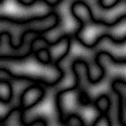

# Pyxel API sample

更新日：2023-03-25  
バージョン：Pyxel 1.9版  
  
## contents
- [システム](api_system.md#システム), [リソース](api_system.md#リソース), [入力](api_system.md#入力)  
- [グラフィックス](api_graphics.md#グラフィックス), [イメージクラス](api_graphics.md#イメージクラス), [タイルマップクラス](api_graphics.md#タイルマップクラス)   
- [オーディオ](api_audio.md#オーディオ), [サウンドクラス](api_audio.md#サウンドクラス), [ミュージッククラス](api_audio.md#ミュージッククラス)   
- [数学](api_math.md)    
  
[Pyxel APIリファレンス](https://github.com/kitao/pyxel/blob/main//docs/README.ja.md) のAPI実行例です。  
  
  
※下記import文でPyxelをインポートしたときのAPIの呼び出し記述になります。
``` python
import pyxel
```
  
## 数学
  
- ceil(x)  
  x以上の最小の整数を返します。
``` python
n = pyxel.ceil( 4.125 )
print(n)    # 5
```
- floor(x)  
  x以下の最大の整数を返します。
``` python
n = pyxel.floor( 9.99 )
print(n)    # 9
```
  
- sgn(x)  
  xが正の時に 1、0 の時に 0、負の時に-1 を返します。
``` python
print( pyxel.sgn( 20 ) )  # 1.0
print( pyxel.sgn(  0 ) )  # 0.0
print( pyxel.sgn( -3 ) )  # -1.0
```
  
- sqrt(x)  
  xの平方根を返します。
``` python
a = 3
b = 4
c = pyxel.sqrt(a**2 + b**2)
print(c)    # 5.0
```
``` python
import pyxel
pyxel.init(128, 128)

x1 = 16
y1 = 16
distance = 0

def update():
    global distance
    dx = pyxel.mouse_x - x1
    dy = pyxel.mouse_y - y1
    distance = pyxel.sqrt(dx**2 + dy**2)
    return

def draw():
    pyxel.cls(0)
    pyxel.line(x1,y1, pyxel.mouse_x,pyxel.mouse_y, 7)
    pyxel.text(1,1, "distance="+str(distance),7)
    return

pyxel.run(update, draw)
```
  
- sin(deg)  
  deg度(Degree)の正弦を返します。
``` python
import pyxel
pyxel.init(128, 128)

x = 0
y = 0
deg = 0

def update():
    global x,y,deg
    x += 1
    if pyxel.width < x:
        x = 0
    y = pyxel.sin(deg) * 40
    deg += 10
    return

def draw():
    pyxel.cls(0)
    pyxel.camera(0,-64)
    pyxel.circ(x,y, 2, 7)
    return

pyxel.run(update, draw)
```
  
  
- cos(deg)  
  deg度(Degree)の余弦を返します。
``` python
import pyxel
pyxel.init(128,128)

x = 0
y = 0
deg = 0
r = 60
def update():
    global x,y,deg
    x = pyxel.cos(deg)*r
    y = pyxel.sin(deg)*r
    deg += 2
    return

def draw():
    pyxel.cls(0)
    pyxel.camera(-64,-64)
    pyxel.circ( x, y, 3, 7)
    return

pyxel.run(update,draw)
```
  
  
- atan2(y, x)  
  y/xの逆正接を度(Degree)で返します。※引数の順番注意
``` python
import pyxel
pyxel.init(128,128)

x = 50
y = x * pyxel.sqrt(3)
deg = pyxel.atan2(y,x)

pyxel.cls(0)
pyxel.trib(0,0, x,0, x,y, 7)
pyxel.text(10,4, str(deg), 10)
pyxel.show()
```
  
  
``` python
import pyxel
pyxel.init(128,128)

x = 0
y = 0
deg = 0

def update():
    global x,y,deg
    x = pyxel.mouse_x
    y = pyxel.mouse_y
    deg = pyxel.atan2(y,x)
    return

def draw():
    pyxel.cls(0)
    pyxel.camera(-64,-64)
    pyxel.line(-64,0, 64,0, 7)
    pyxel.line(0,-64, 0,64, 7)
    pyxel.line(0,0, x,y, 10)
    pyxel.text(-63,-63, str(deg), 7)
    return

pyxel.run(update,draw)
```
  
  
- rseed(seed: int)  
  乱数生成器のシードを設定します。
``` python
import pyxel
pyxel.init(128,128)

for i in range(2):
    print( i,end=": ")
    pyxel.rseed(42)
    for j in range(10):
        print(pyxel.rndi(0, 100),end=",")
    print("\n")

pyxel.cls(0)
pyxel.show()
```
<pre>0: 8,38,68,93,100,77,72,29,32,88,
1: 8,38,68,93,100,77,72,29,32,88,
</pre>  
　※シードを同じ値で指定すると同じ結果になる。（プログラムを再実行しても同じ）
  
- rndi(a, b)  
  a以上b以下のランダムな整数を返します。
``` python
import pyxel
pyxel.init(128,128)

for i in range(2):
    print( i,end=": ")
    #pyxel.rseed(42)
    for j in range(10):
        print(pyxel.rndi(0, 100),end=",")
    print("\n")

pyxel.cls(0)
pyxel.show()
```
<pre>0: 69,1,74,9,54,72,36,51,89,58,
1: 9,4,66,10,94,8,35,32,37,4,
</pre>  
　※Pyxel初期化時に自動的に設定されたシードが使われる
  
- rndf(a, b)  
  a以上b以下のランダムな小数を返します。
``` python
import pyxel
pyxel.init(128,128)

for i in range(10):
    print(pyxel.rndf(0, 100))

pyxel.cls(0)
pyxel.show()
```
<pre>79.75695502930245
79.48298730720167
20.276567720959545
53.94942619617053
79.57768003867349
77.46772819247893
15.408494810028332
60.05476275619585
38.617613577837695
64.38980237759799
</pre>
  
- nseed(seed)  
  Perlin ノイズのシードを設定します。  
　（パーリンノイズは座標ごとの乱数でなだらかな変化の値を得られるもの。ゲームで地形生成やテクスチャに利用される）
``` python
import pyxel
SIZE = 128
pyxel.init(SIZE,SIZE)

pyxel.cls(0)
pyxel.nseed(1)
scale = 0.03
for y in range(SIZE):
    for x in range(SIZE):
        col = pyxel.floor(abs(pyxel.noise(x*scale, y*scale) * 16))
        pyxel.pset(x,y,col)

pyxel.show()
```
  
　（pyxel.nseed(1)の設定値を100や123456に変更しても結果が変わらないため，使い方の調査が必要）
  
- noise(x, [y], [z])  
  指定された座標の Perlin ノイズ値を返します。
``` python
import pyxel
SIZE = 128
pyxel.init(SIZE,SIZE)
# パレットをグレースケールに書き換え
for i in range(16):
    pyxel.colors[i] = i * 0x101010
    
pyxel.cls(0)

# Perlinノイズ scaleが大きいほど変化が多くなる
scale = 0.04
z = 1
for y in range(SIZE):
    for x in range(SIZE):
        col = pyxel.floor(abs(pyxel.noise(x*scale, y*scale, z*scale) * 16))
        pyxel.pset(x,y,col)

pyxel.show()
```
z = 1   
z = 2   
z = 5   
  
  
  [TOPに戻る](api_math.md)
  